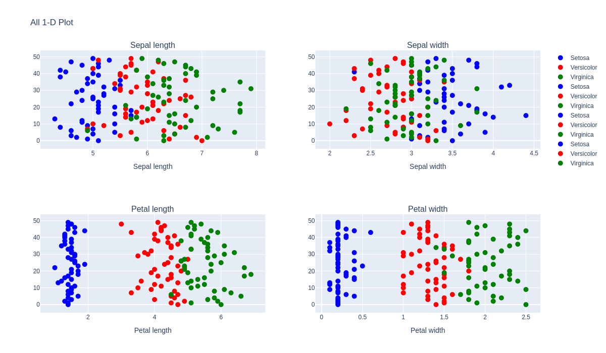
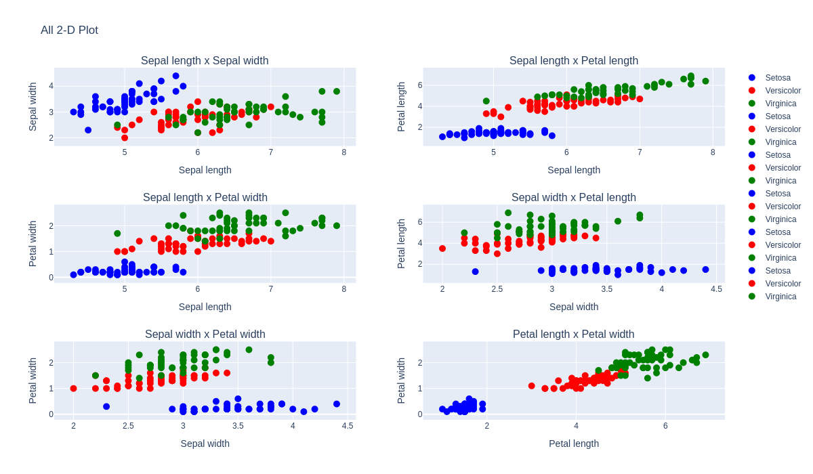
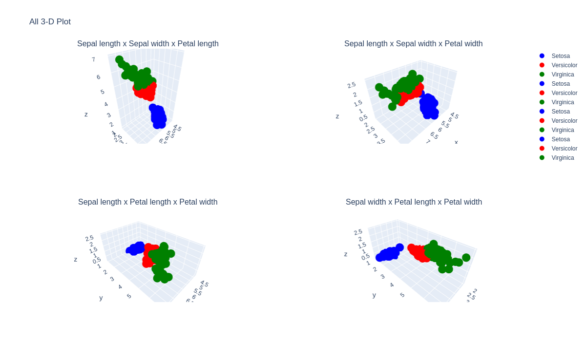

# NYCU Machine Learning 2024 : Report

> Written By 313511068 練鈞揚

---

## Introduction

In this assignment, we will utilize the Iris dataset to explore and analyze classification ratios and their corresponding relationships through scatter plot visualizations. The Iris dataset, a well-known benchmark in machine learning, provides measurements of various flower attributes across three distinct species. By examining these attributes through scatter plots, we aim to gain insights into the distribution and separation of species in feature space. This analysis will help us understand how different features correlate with each species and how effectively classification algorithms can distinguish between them.

## Experiment

Here is the K-NN result in different K (K means number of feature to use)

|    | Name                                                    | Avg acc k=1   | Avg acc k=3   |
|---:|:--------------------------------------------------------|:--------------|:--------------|
|  0 | Sepal length                                            | 58.00%        | 62.67%        |
|  1 | Sepal width                                             | 46.00%        | 46.67%        |
|  2 | Petal length                                            | 93.33%        | 94.00%        |
|  3 | Petal width                                             | 95.33%        | 96.00%        |
|  4 | Sepal length x Sepal width                              | 70.00%        | 74.67%        |
|  5 | Sepal length x Petal length                             | 92.67%        | 92.67%        |
|  6 | Sepal length x Petal width                              | 87.33%        | 94.00%        |
|  7 | Sepal width x Petal length                              | 92.00%        | 92.00%        |
|  8 | Sepal width x Petal width                               | 93.33%        | 95.33%        |
|  9 | Petal length x Petal width                              | 95.33%        | 95.33%        |
| 10 | Sepal length x Sepal width x Petal length               | 92.67%        | 92.67%        |
| 11 | Sepal length x Sepal width x Petal width                | 92.67%        | 90.67%        |
| 12 | Sepal length x Petal length x Petal width               | 94.67%        | 95.33%        |
| 13 | Sepal width x Petal length x Petal width                | 96.67%        | 97.33%        |
| 14 | Sepal length x Sepal width x Petal length x Petal width | 94.67%        | 94.00%        |

---

## Analysis

In the analysis, it was observed that the features `Petal Width` and `Petal Length` exhibit superior performance in predictive modeling. Specifically, utilizing these two features significantly enhances the model's accuracy, achieving an average accuracy rate of approximately `90%`. This performance surpasses that of other feature combinations, highlighting the critical role these attributes play in the model's effectiveness.

### 1D plot

The 1D plot highlights that features such as `Petal width` and `Petal length`exhibit less overlap in their respective data points compared to other features. This reduced overlap suggests that these features are more distinct and thus easier for the K-Nearest Neighbors (K-NN) algorithm to classify accurately.

### 2D plot

In the 2D plot, it becomes evident that when either axis is `Petal width` or `Petal length`, the K-NN algorithm performs exceptionally well. Specifically, the feature combinations of `Petal length x Petal width` show high classification accuracy, achieving`95.33%`in different K values. This indicates that these features significantly enhance the algorithm’s ability to distinguish between classes.

### 3D plot

The 3D plot further confirms the importance of `Petal width` and `Petal length`. It reveals that certain feature combinations, such as `Sepal length x Petal length x Petal width` and `Sepal width x Petal length x Petal width`, yield similar high accuracy rates. Notably, `Sepal width x Petal length x Petal width` tends to have a higher average accuracy compared to `Sepal length x Petal length x Petal width`. The graph demonstrates that `Sepal length x Petal length x Petal width` facilitates easier classification than `Sepal width x Petal length x Petal width`.

### About in 4-Dim

In the 4D space, which incorporates all available features, the average classification accuracy is lower compared to the 3D space. This reduction indicates that including less relevant features can diminish the K-NN algorithm's classification performance, suggesting that feature selection is crucial for optimal accuracy.

## Conclusion

This analysis reveals that not all features contribute equally to classification performance. The most effective feature combinations are those that include `Petal width` and `Petal length`. As the number of features increases, especially when including less relevant ones, the classification accuracy may decrease. Therefore, focusing on the most pertinent features and selecting an appropriate value for K can significantly improve the K-NN algorithm's performance.
