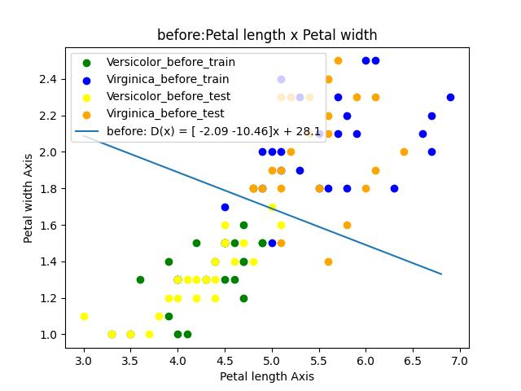
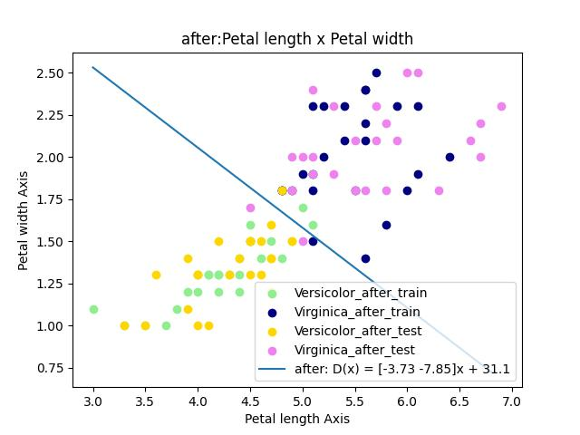
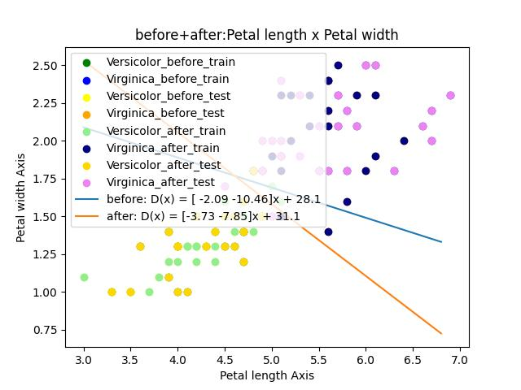
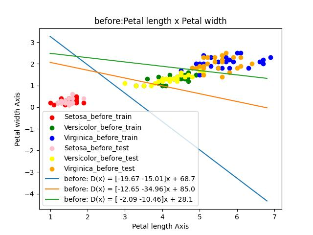
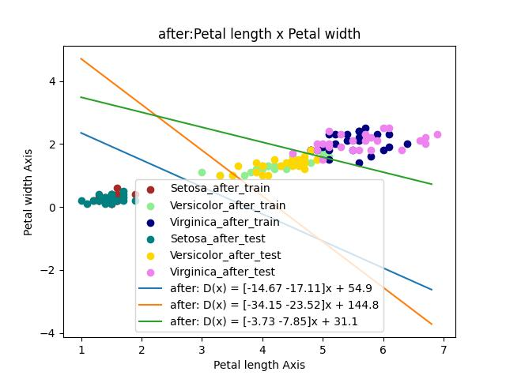
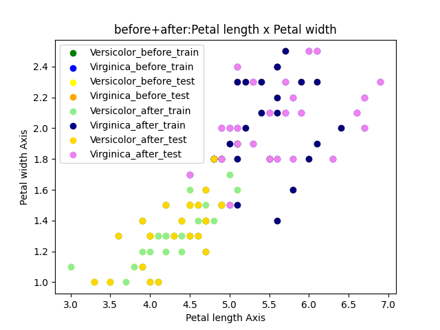
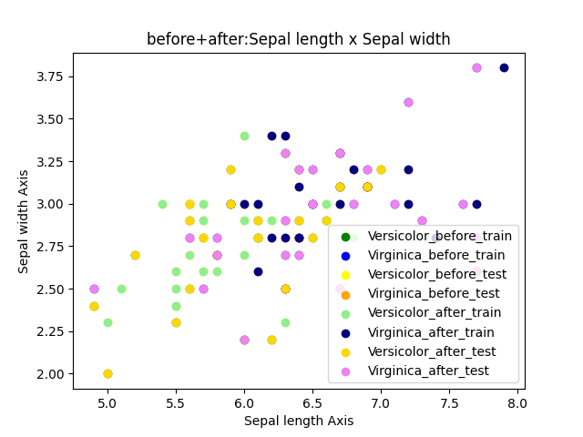

# NYCU Machine Learning 2024: HW2 Report

> Written By 313511068 練鈞揚
---

## Introduction

In this assignment, we utilize Linear Discriminant Analysis (LDA) to classify the Iris dataset. We evaluate the model's performance by analyzing the Receiver Operating Characteristic (ROC) curve and the Area Under the Curve (AUC) under different penalty weights. Finally, we extend LDA for multi-class classification using a one-vs-one strategy.

## Experiment

### LDA in Binary classification

|    | Name                                  | Weight Vector   |   Bias | Acc         |
|---:|:--------------------------------------|:----------------|-------:|:------------|
|  0 | (Before) Pos:Versicolor,Neg:Virginica | [-2.09,-10.46]  |  28.1  | Acc :94.00% |
|  1 | (After) Pos:Versicolor,Neg:Virginica  | [-3.73,-7.85]   |  31.08 | Acc :94.00% |

> Average Acc : 94.00%

### LDA in Binary classification ROC AUC Graph

***Dataset: Using all feature***

|    | Model             |   AUC |
|---:|:------------------|------:|
|  0 | before_c1=1,c2=1  |  0.94 |
|  1 | after_c1=1,c2=1   |  0.94 |
|  2 | before_c1=1,c2=10 |  0.98 |
|  3 | after_c1=1,c2=10  |  0.94 |
|  4 | before_c1=10,c2=1 |  0.88 |
|  5 | after_c1=10,c2=1  |  1    |

***Dataset: Using 1,2 feature***

|    | Model             |   AUC |
|---:|:------------------|------:|
|  0 | before_c1=1,c2=1  |  0.74 |
|  1 | after_c1=1,c2=1   |  0.7  |
|  2 | before_c1=1,c2=10 |  0.5  |
|  3 | after_c1=1,c2=10  |  0.56 |
|  4 | before_c1=10,c2=1 |  0.5  |
|  5 | after_c1=10,c2=1  |  0.62 |

***Dataset: Using 3,4 feature***

|    | Model             |   AUC |
|---:|:------------------|------:|
|  0 | before_c1=1,c2=1  |  0.94 |
|  1 | after_c1=1,c2=1   |  0.94 |
|  2 | before_c1=1,c2=10 |  0.94 |
|  3 | after_c1=1,c2=10  |  0.9  |
|  4 | before_c1=10,c2=1 |  0.82 |
|  5 | after_c1=10,c2=1  |  0.94 |

### LDA in multi classification

|    | Name                                 | Weight Vector                                  | Bias               |Acc         |
|---:|:-------------------------------------|:-----------------------------------------------|:-------------------|:------------|
|  0 | (Before) Setosa,Versicolor,Virginica | [-19.67,-15.01],[-12.65,-34.96],[-2.09,-10.46] | 68.72,84.97,28.10  |Acc :96.00% |
|  1 | (After) Setosa,Versicolor,Virginica  | [-14.67,-17.11],[-34.15,-23.52],[-3.73,-7.85]  | 54.87,144.81,31.08 |Acc :96.00% |

> Average Acc : 96.00%

## Analysis

### LDA in Binary classification analysis

In LDA classification, the decision boundary varies depending on the dataset used for training, as illustrated in the following figure.

***Training on the training data, testing on the test data***

***Training on the test data, testing on the training data***

***2 line put to gather***

### LDA in multi-classification analysis

***Training on the training data, testing on the test data***

***Training on the test data, testing on the training data***

### ROC and AUC Analysis of LDA for Binary Classification

In the dataset, the 3rd (Petal Length) and 4th (Petal Width) features are easily separable in the feature space, while the 1st (Sepal length) and 2nd (Sepal width) features are more difficult to distinguish. In the next experiment, we will examine the effect of different penalty weights (C) on the ROC and AUC curves.

***3(Petal length) and 4(Petal width) feature***

***1(Sepal length) and 2(Sepal width) feature***

When the penalty weights are the same (c1 == c2) and different portions of the dataset (using features 3 and 4) are utilized for training, the AUC remains relatively consistent, fluctuating around ±0.01. However, if the penalty weights differ (c1 ≠ c2), the AUC can increase or decrease by approximately ±0.1. Consequently, it is essential to determine which class—positive or negative—the model should focus on, as this prioritization significantly impacts the overall model performance.

In the ROC-AUC graph, when the ROC curve closely resembles a square, the AUC reaches its maximum value. This makes the ROC-AUC graph a valuable tool for analyzing model performance.

When training the model on different features from the same dataset, the results can vary. Features that are more difficult to separate (such as features 1 and 2) tend to result in a lower AUC, while more easily separable features (like 3 and 4) yield a higher AUC. Hence, there is a proportional relationship between the ease of feature separation and the resulting AUC.

In this experiment, if the model focuses on classifying Versicolor (C1) and is trained on all features, testing it on the training set can achieve a perfect AUC score of 1.0.

## Conclusion

- Selecting the correct class focus and dataset is crucial for improving model performance.
- Use ROC-AUC analysis to evaluate the model.
- The ease of feature separation is directly proportional to AUC performance.
