# NYCU Machine Learning 2024 : HW3 Report

> Written By 313511068 練鈞揚
---

## Introduction

In this assignment, we apply Support Vector Machine (SVM) models to classify the Iris dataset, aiming to compare the performance of linear and non-linear SVM hyperplanes. Through this comparison, we examine how different SVM kernels influence classification effectiveness on the dataset.

## Experiment
>
> Detail at [assets](./assets/test_result.json)

|    | model_name          |   acc |    bias | image                                  |
|---:|:--------------------|------:|--------:|:---------------------------------------|
|  0 | linear___C_1        |  0.96 | 10.6297 | 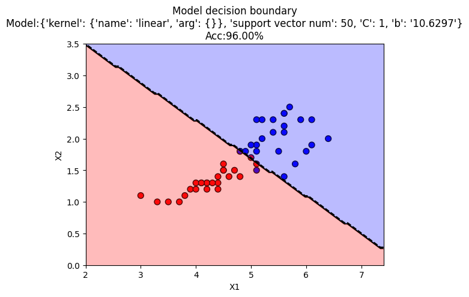        |
|  1 | linear___C_10       |  0.94 | 15.0764 | 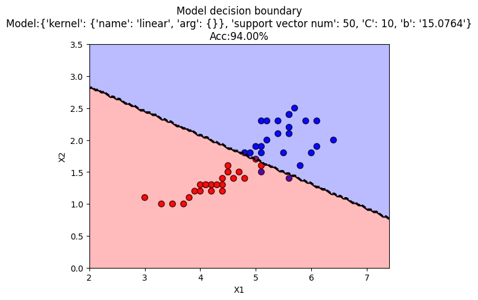       |
|  2 | linear___C_100      |  0.92 | 11.2977 | 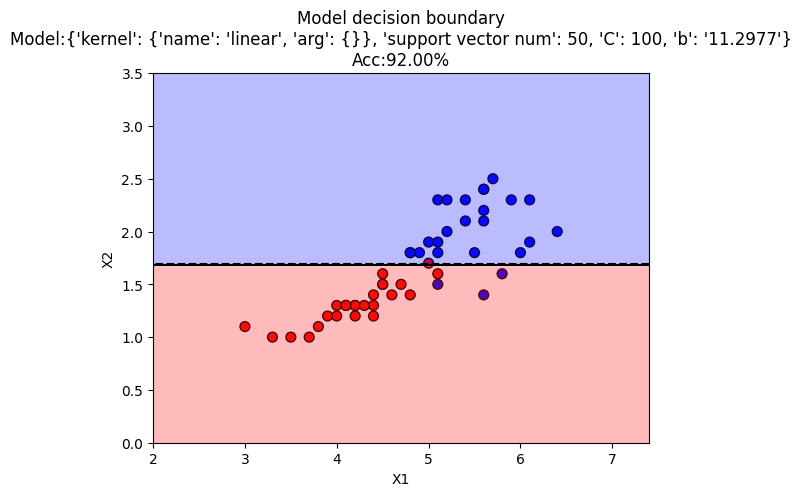      |
|  3 | rbf_sigma_5_C_10    |  0.9  |  0.0049 | 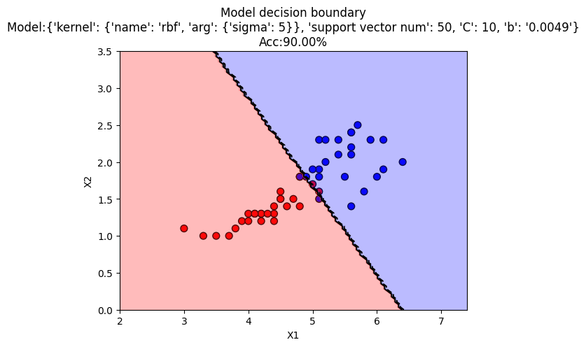    |
|  4 | rbf_sigma_1_C_10    |  0.96 | -0.2601 | 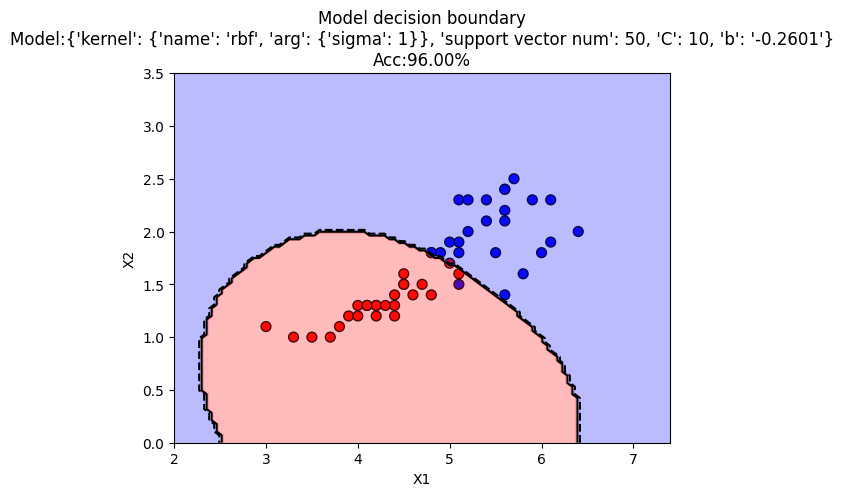    |
|  5 | rbf_sigma_0.5_C_10  |  0.96 | -0.3942 | 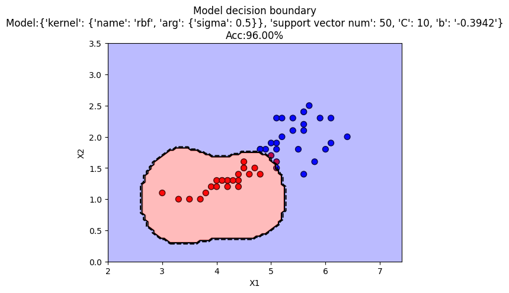  |
|  6 | rbf_sigma_0.1_C_10  |  0.88 | -0.1574 | 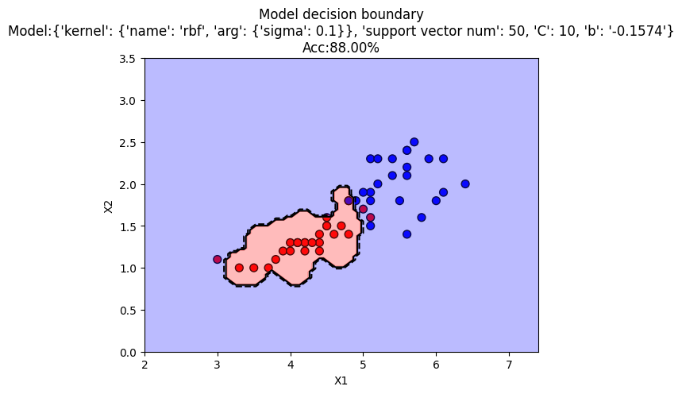  |
|  7 | rbf_sigma_0.05_C_10 |  0.82 | -0.1106 | 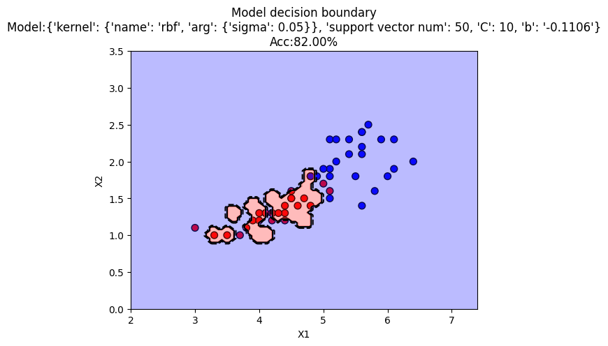 |
|  8 | poly_p_1_C_10       |  0.94 | 15.0764 | 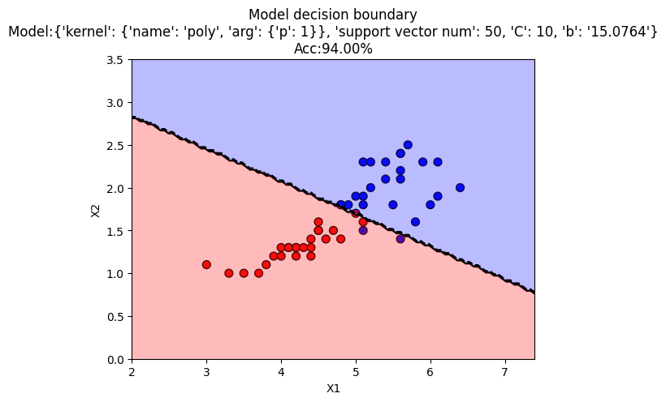       |
|  9 | poly_p_2_C_10       |  0.9  | 14.7951 | 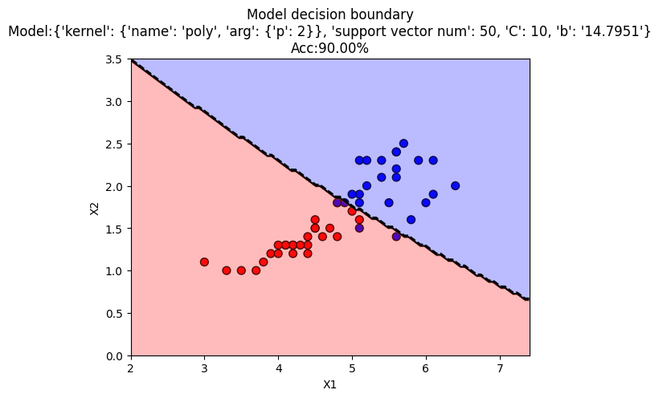       |
| 10 | poly_p_3_C_10       |  0.88 |  8.2678 | 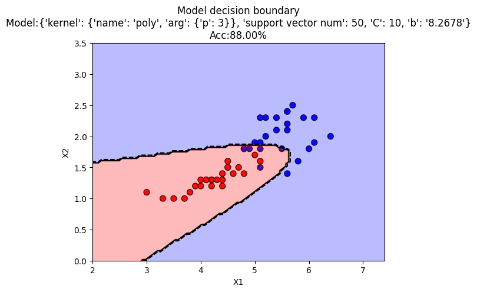       |
| 11 | poly_p_4_C_10       |  0.86 |  7.0988 | 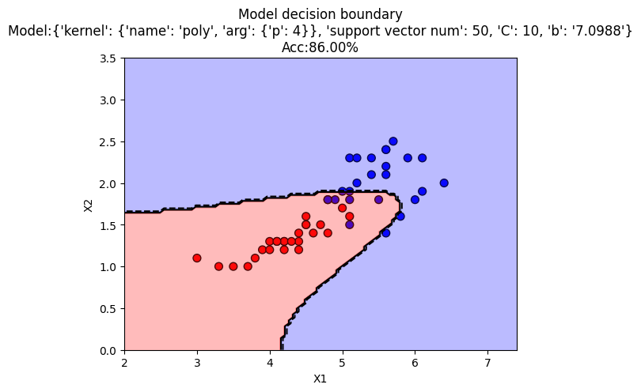       |
| 12 | poly_p_5_C_10       |  0.78 |  6.6671 | 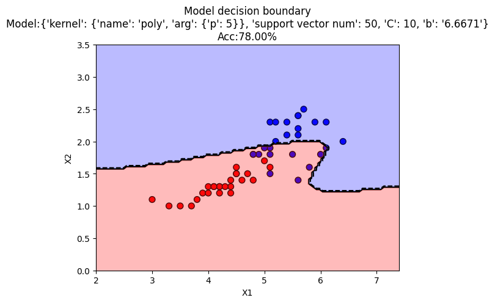       |

## Analysis

In this experiment, we explore the effects of various SVM kernels—specifically, the linear, radial basis function (RBF), and polynomial (Poly) kernels—on the classification of data. Each kernel produces a unique hyperplane:

- **Linear Kernel**: The hyperplane is a straight line, effectively bisecting the data in cases where a linear separation is feasible.
- **RBF Kernel**: The hyperplane forms a circular decision boundary, surrounding clusters of data to best capture non-linear relationships.
- **Polynomial Kernel**: The hyperplane is a polynomial function (e.g., \(x^2\) when \(p = 2\)), allowing flexible boundaries that can fit more complex data patterns.

As we adjust kernel parameters, the hyperplane’s shape and flexibility change accordingly. For instance, with a polynomial kernel, increasing the degree \(p\) makes the hyperplane more flexible, potentially capturing intricate patterns in the data. However, this also increases the risk of overfitting, as the model may start fitting to noise in the training data.

Similarly, with the RBF kernel, decreasing the sigma parameter can lead to overfitting by narrowing the model’s focus on specific data points. To mitigate overfitting, we can increase the penalty weight \(C\), which encourages the model to generalize better rather than conform too closely to the training data.

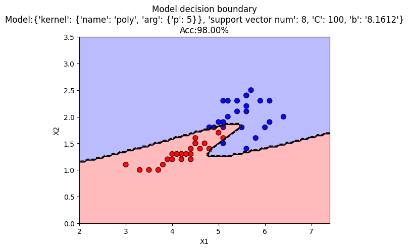

The above image illustrates a polynomial kernel with \(p=5\) and an increased penalty weight \(C=100\). Here, accuracy improves from 78% to 98%, highlighting that increasing \(C\) helps manage overfitting effectively.

## Conclusion

Choosing the right SVM kernel and parameters is crucial for model performance. For simpler, linearly separable datasets, a linear or polynomial kernel is often sufficient. However, for more complex datasets, the RBF kernel is recommended. To address overfitting, especially in cases with high flexibility (e.g., high-degree polynomial or low-sigma RBF), it is advisable to increase the penalty parameter \(C\) to a balanced level that promotes generalization without sacrificing accuracy.
