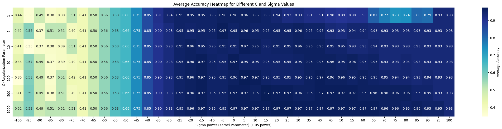
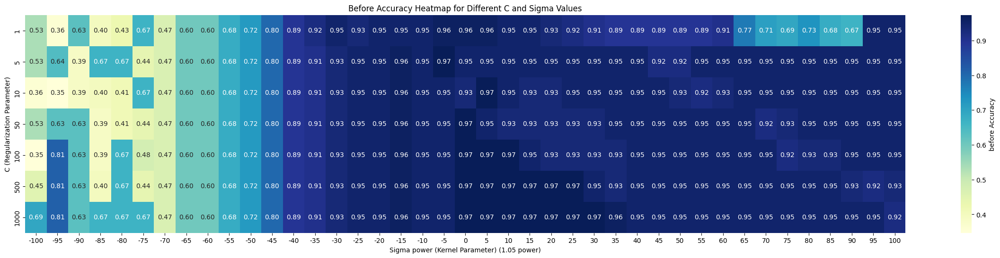
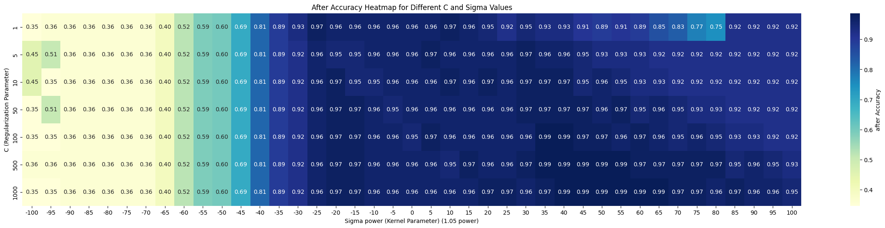

# NYCU Machine Learning 2024: HW4 Report

> Written By 313511068 練鈞揚

---

## Introduction

In this homework, the Iris dataset is used to train a Support Vector Machine (SVM) for solving a multi-class classification problem. The "one-vs-one" strategy is applied to handle the classification of three different classes. The SVM's hyperparameters, including the regularization parameter $C$ and the kernel parameter $\sigma$, are optimized using a grid search approach. To enhance the generalization ability of the model, two-fold cross-validation is performed during the hyperparameter optimization process. This ensures that the selected best parameter combination can generalize well to unseen data, improving the model's robustness and performance.

## Methodology

1. **SVM Model**: The SVM classifier is trained using the Iris dataset, with the task of classifying three different species of flowers. We use the Radial Basis Function (RBF) kernel for non-linear classification. The parameters C and sigma  are crucial to the model's performance and are tuned using grid search.

2. **Grid Search**: A grid search approach is employed to find the optimal values for C and sigma. The search space for C includes values from a range of 1 to 1000, while sigma is searched over powers of 1.05. This approach exhaustively tests various combinations of these parameters to determine the best-performing model.

3. **Two-Fold Cross Validation**: Two-fold cross-validation is used to validate the performance of the model. This technique divides the dataset into two parts, using one part for training and the other for validation, and ensures that the final model generalizes well to unseen data.

## Experiment

### Best C and sigma

> sigma is 1.05^5

```sh
TestResult(
    model=class name: ['Setosa', 'Versicolor', 'Virginica'], C: 100, kernel: rbf ({'sigma': 1.2762815625000004}),
    C=100,
    sigma=1.2762815625000004,
    before_acc=np.float64(0.9733333333333334),
    after_acc=np.float64(0.9733333333333334),
    avg_acc=np.float64(0.9733333333333334)
)
```

### Table of Multi SVM grid search
>
> more detail in [here](./assets/multi_class_svm_result.csv)

|     |    C |   before_acc |   after_acc |   avg_acc |   1.05 power |
|----:|-----:|-------------:|------------:|----------:|-------------:|
|   0 |    1 |        53.33 |       34.67 |     44    |         -100 |
|   1 |    1 |        36    |       36    |     36    |          -95 |
|   2 |    1 |        62.67 |       36    |     49.33 |          -90 |
|   3 |    1 |        40    |       36    |     38    |          -85 |
|   4 |    1 |        42.67 |       36    |     39.33 |          -80 |
|   5 |    1 |        66.67 |       36    |     51.33 |          -75 |
|   6 |    1 |        46.67 |       36    |     41.33 |          -70 |
|   7 |    1 |        60    |       40    |     50    |          -65 |
|   8 |    1 |        60    |       52    |     56    |          -60 |
|   9 |    1 |        68    |       58.67 |     63.33 |          -55 |
|  10 |    1 |        72    |       60    |     66    |          -50 |
|  11 |    1 |        80    |       69.33 |     74.67 |          -45 |
|  12 |    1 |        89.33 |       81.33 |     85.33 |          -40 |
|  13 |    1 |        92    |       89.33 |     90.67 |          -35 |
|  14 |    1 |        94.67 |       93.33 |     94    |          -30 |
|  15 |    1 |        93.33 |       97.33 |     95.33 |          -25 |
|  16 |    1 |        94.67 |       96    |     95.33 |          -20 |
|  17 |    1 |        94.67 |       96    |     95.33 |          -15 |
|  18 |    1 |        94.67 |       96    |     95.33 |          -10 |
|  19 |    1 |        96    |       96    |     96    |           -5 |
|  20 |    1 |        96    |       96    |     96    |            0 |
|  21 |    1 |        96    |       96    |     96    |            5 |
|  22 |    1 |        94.67 |       97.33 |     96    |           10 |
|  23 |    1 |        94.67 |       96    |     95.33 |           15 |
|  24 |    1 |        93.33 |       94.67 |     94    |           20 |
|  25 |    1 |        92    |       92    |     92    |           25 |
|  26 |    1 |        90.67 |       94.67 |     92.67 |           30 |
|  27 |    1 |        89.33 |       93.33 |     91.33 |           35 |
|  28 |    1 |        89.33 |       93.33 |     91.33 |           40 |
|  29 |    1 |        89.33 |       90.67 |     90    |           45 |
|  30 |    1 |        89.33 |       89.33 |     89.33 |           50 |
|  31 |    1 |        89.33 |       90.67 |     90    |           55 |
|  32 |    1 |        90.67 |       89.33 |     90    |           60 |
|  33 |    1 |        77.33 |       85.33 |     81.33 |           65 |
|  34 |    1 |        70.67 |       82.67 |     76.67 |           70 |
|  35 |    1 |        69.33 |       77.33 |     73.33 |           75 |
|  36 |    1 |        73.33 |       74.67 |     74    |           80 |
|  37 |    1 |        68    |       92    |     80    |           85 |
|  38 |    1 |        66.67 |       92    |     79.33 |           90 |
|  39 |    1 |        94.67 |       92    |     93.33 |           95 |
|  40 |    1 |        94.67 |       92    |     93.33 |          100 |
|  41 |    5 |        53.33 |       45.33 |     49.33 |         -100 |
|  42 |    5 |        64    |       50.67 |     57.33 |          -95 |
|  43 |    5 |        38.67 |       36    |     37.33 |          -90 |
|  44 |    5 |        66.67 |       36    |     51.33 |          -85 |
|  45 |    5 |        66.67 |       36    |     51.33 |          -80 |
|  46 |    5 |        44    |       36    |     40    |          -75 |
|  47 |    5 |        46.67 |       36    |     41.33 |          -70 |
|  48 |    5 |        60    |       40    |     50    |          -65 |
|  49 |    5 |        60    |       52    |     56    |          -60 |
|  50 |    5 |        68    |       58.67 |     63.33 |          -55 |
|  51 |    5 |        72    |       60    |     66    |          -50 |
|  52 |    5 |        80    |       69.33 |     74.67 |          -45 |
|  53 |    5 |        89.33 |       81.33 |     85.33 |          -40 |
|  54 |    5 |        90.67 |       89.33 |     90    |          -35 |
|  55 |    5 |        93.33 |       92    |     92.67 |          -30 |
|  56 |    5 |        94.67 |       96    |     95.33 |          -25 |
|  57 |    5 |        94.67 |       94.67 |     94.67 |          -20 |
|  58 |    5 |        96    |       94.67 |     95.33 |          -15 |
|  59 |    5 |        94.67 |       96    |     95.33 |          -10 |
|  60 |    5 |        97.33 |       96    |     96.67 |           -5 |
|  61 |    5 |        94.67 |       96    |     95.33 |            0 |
|  62 |    5 |        94.67 |       97.33 |     96    |            5 |
|  63 |    5 |        94.67 |       96    |     95.33 |           10 |
|  64 |    5 |        94.67 |       96    |     95.33 |           15 |
|  65 |    5 |        94.67 |       96    |     95.33 |           20 |
|  66 |    5 |        94.67 |       96    |     95.33 |           25 |
|  67 |    5 |        94.67 |       97.33 |     96    |           30 |
|  68 |    5 |        94.67 |       96    |     95.33 |           35 |
|  69 |    5 |        94.67 |       96    |     95.33 |           40 |
|  70 |    5 |        92    |       94.67 |     93.33 |           45 |
|  71 |    5 |        92    |       93.33 |     92.67 |           50 |
|  72 |    5 |        94.67 |       93.33 |     94    |           55 |
|  73 |    5 |        94.67 |       93.33 |     94    |           60 |
|  74 |    5 |        94.67 |       92    |     93.33 |           65 |
|  75 |    5 |        94.67 |       92    |     93.33 |           70 |
|  76 |    5 |        94.67 |       92    |     93.33 |           75 |
|  77 |    5 |        94.67 |       92    |     93.33 |           80 |
|  78 |    5 |        94.67 |       92    |     93.33 |           85 |
|  79 |    5 |        94.67 |       92    |     93.33 |           90 |
|  80 |    5 |        94.67 |       92    |     93.33 |           95 |
|  81 |    5 |        94.67 |       92    |     93.33 |          100 |
|  82 |   10 |        36    |       45.33 |     40.67 |         -100 |
|  83 |   10 |        34.67 |       34.67 |     34.67 |          -95 |
|  84 |   10 |        38.67 |       36    |     37.33 |          -90 |
|  85 |   10 |        40    |       36    |     38    |          -85 |
|  86 |   10 |        41.33 |       36    |     38.67 |          -80 |
|  87 |   10 |        66.67 |       36    |     51.33 |          -75 |
|  88 |   10 |        46.67 |       36    |     41.33 |          -70 |
|  89 |   10 |        60    |       40    |     50    |          -65 |
|  90 |   10 |        60    |       52    |     56    |          -60 |
|  91 |   10 |        68    |       58.67 |     63.33 |          -55 |
|  92 |   10 |        72    |       60    |     66    |          -50 |
|  93 |   10 |        80    |       69.33 |     74.67 |          -45 |
|  94 |   10 |        89.33 |       81.33 |     85.33 |          -40 |
|  95 |   10 |        90.67 |       89.33 |     90    |          -35 |
|  96 |   10 |        93.33 |       92    |     92.67 |          -30 |
|  97 |   10 |        94.67 |       96    |     95.33 |          -25 |
|  98 |   10 |        94.67 |       97.33 |     96    |          -20 |
|  99 |   10 |        96    |       94.67 |     95.33 |          -15 |
| 100 |   10 |        94.67 |       94.67 |     94.67 |          -10 |
| 101 |   10 |        94.67 |       96    |     95.33 |           -5 |
| 102 |   10 |        93.33 |       96    |     94.67 |            0 |
| 103 |   10 |        97.33 |       96    |     96.67 |            5 |
| 104 |   10 |        94.67 |       97.33 |     96    |           10 |
| 105 |   10 |        93.33 |       96    |     94.67 |           15 |
| 106 |   10 |        93.33 |       97.33 |     95.33 |           20 |
| 107 |   10 |        94.67 |       96    |     95.33 |           25 |
| 108 |   10 |        94.67 |       97.33 |     96    |           30 |
| 109 |   10 |        94.67 |       97.33 |     96    |           35 |
| 110 |   10 |        94.67 |       97.33 |     96    |           40 |
| 111 |   10 |        94.67 |       94.67 |     94.67 |           45 |
| 112 |   10 |        93.33 |       96    |     94.67 |           50 |
| 113 |   10 |        92    |       94.67 |     93.33 |           55 |
| 114 |   10 |        93.33 |       93.33 |     93.33 |           60 |
| 115 |   10 |        94.67 |       93.33 |     94    |           65 |
| 116 |   10 |        94.67 |       92    |     93.33 |           70 |
| 117 |   10 |        94.67 |       92    |     93.33 |           75 |
| 118 |   10 |        94.67 |       92    |     93.33 |           80 |
| 119 |   10 |        94.67 |       92    |     93.33 |           85 |
| 120 |   10 |        94.67 |       92    |     93.33 |           90 |
| 121 |   10 |        94.67 |       92    |     93.33 |           95 |
| 122 |   10 |        94.67 |       92    |     93.33 |          100 |
| 123 |   50 |        53.33 |       34.67 |     44    |         -100 |
| 124 |   50 |        62.67 |       50.67 |     56.67 |          -95 |
| 125 |   50 |        62.67 |       36    |     49.33 |          -90 |
| 126 |   50 |        38.67 |       36    |     37.33 |          -85 |
| 127 |   50 |        41.33 |       36    |     38.67 |          -80 |
| 128 |   50 |        44    |       36    |     40    |          -75 |
| 129 |   50 |        46.67 |       36    |     41.33 |          -70 |
| 130 |   50 |        60    |       40    |     50    |          -65 |
| 131 |   50 |        60    |       52    |     56    |          -60 |
| 132 |   50 |        68    |       58.67 |     63.33 |          -55 |
| 133 |   50 |        72    |       60    |     66    |          -50 |
| 134 |   50 |        80    |       69.33 |     74.67 |          -45 |
| 135 |   50 |        89.33 |       81.33 |     85.33 |          -40 |
| 136 |   50 |        90.67 |       89.33 |     90    |          -35 |
| 137 |   50 |        93.33 |       92    |     92.67 |          -30 |
| 138 |   50 |        94.67 |       96    |     95.33 |          -25 |
| 139 |   50 |        94.67 |       97.33 |     96    |          -20 |
| 140 |   50 |        96    |       97.33 |     96.67 |          -15 |
| 141 |   50 |        94.67 |       96    |     95.33 |          -10 |
| 142 |   50 |        94.67 |       94.67 |     94.67 |           -5 |
| 143 |   50 |        97.33 |       96    |     96.67 |            0 |
| 144 |   50 |        94.67 |       96    |     95.33 |            5 |
| 145 |   50 |        93.33 |       96    |     94.67 |           10 |
| 146 |   50 |        93.33 |       96    |     94.67 |           15 |
| 147 |   50 |        93.33 |       96    |     94.67 |           20 |
| 148 |   50 |        93.33 |       96    |     94.67 |           25 |
| 149 |   50 |        93.33 |       97.33 |     95.33 |           30 |
| 150 |   50 |        94.67 |       97.33 |     96    |           35 |
| 151 |   50 |        94.67 |       97.33 |     96    |           40 |
| 152 |   50 |        94.67 |       97.33 |     96    |           45 |
| 153 |   50 |        94.67 |       96    |     95.33 |           50 |
| 154 |   50 |        94.67 |       97.33 |     96    |           55 |
| 155 |   50 |        94.67 |       94.67 |     94.67 |           60 |
| 156 |   50 |        94.67 |       96    |     95.33 |           65 |
| 157 |   50 |        92    |       94.67 |     93.33 |           70 |
| 158 |   50 |        93.33 |       93.33 |     93.33 |           75 |
| 159 |   50 |        94.67 |       93.33 |     94    |           80 |
| 160 |   50 |        94.67 |       92    |     93.33 |           85 |
| 161 |   50 |        94.67 |       92    |     93.33 |           90 |
| 162 |   50 |        94.67 |       92    |     93.33 |           95 |
| 163 |   50 |        94.67 |       92    |     93.33 |          100 |
| 164 |  100 |        34.67 |       34.67 |     34.67 |         -100 |
| 165 |  100 |        81.33 |       34.67 |     58    |          -95 |
| 166 |  100 |        62.67 |       36    |     49.33 |          -90 |
| 167 |  100 |        38.67 |       36    |     37.33 |          -85 |
| 168 |  100 |        66.67 |       36    |     51.33 |          -80 |
| 169 |  100 |        48    |       36    |     42    |          -75 |
| 170 |  100 |        46.67 |       36    |     41.33 |          -70 |
| 171 |  100 |        60    |       40    |     50    |          -65 |
| 172 |  100 |        60    |       52    |     56    |          -60 |
| 173 |  100 |        68    |       58.67 |     63.33 |          -55 |
| 174 |  100 |        72    |       60    |     66    |          -50 |
| 175 |  100 |        80    |       69.33 |     74.67 |          -45 |
| 176 |  100 |        89.33 |       81.33 |     85.33 |          -40 |
| 177 |  100 |        90.67 |       89.33 |     90    |          -35 |
| 178 |  100 |        93.33 |       92    |     92.67 |          -30 |
| 179 |  100 |        94.67 |       96    |     95.33 |          -25 |
| 180 |  100 |        94.67 |       97.33 |     96    |          -20 |
| 181 |  100 |        96    |       97.33 |     96.67 |          -15 |
| 182 |  100 |        94.67 |       96    |     95.33 |          -10 |
| 183 |  100 |        94.67 |       96    |     95.33 |           -5 |
| 184 |  100 |        97.33 |       94.67 |     96    |            0 |
| 185 |  100 |        97.33 |       97.33 |     97.33 |            5 |
| 186 |  100 |        97.33 |       96    |     96.67 |           10 |
| 187 |  100 |        94.67 |       96    |     95.33 |           15 |
| 188 |  100 |        93.33 |       96    |     94.67 |           20 |
| 189 |  100 |        93.33 |       96    |     94.67 |           25 |
| 190 |  100 |        93.33 |       96    |     94.67 |           30 |
| 191 |  100 |        93.33 |       98.67 |     96    |           35 |
| 192 |  100 |        94.67 |       98.67 |     96.67 |           40 |
| 193 |  100 |        94.67 |       97.33 |     96    |           45 |
| 194 |  100 |        94.67 |       97.33 |     96    |           50 |
| 195 |  100 |        94.67 |       96    |     95.33 |           55 |
| 196 |  100 |        94.67 |       97.33 |     96    |           60 |
| 197 |  100 |        94.67 |       96    |     95.33 |           65 |
| 198 |  100 |        94.67 |       94.67 |     94.67 |           70 |
| 199 |  100 |        92    |       96    |     94    |           75 |
| 200 |  100 |        93.33 |       94.67 |     94    |           80 |
| 201 |  100 |        93.33 |       93.33 |     93.33 |           85 |
| 202 |  100 |        94.67 |       93.33 |     94    |           90 |
| 203 |  100 |        94.67 |       92    |     93.33 |           95 |
| 204 |  100 |        94.67 |       92    |     93.33 |          100 |
| 205 |  500 |        45.33 |       36    |     40.67 |         -100 |
| 206 |  500 |        81.33 |       36    |     58.67 |          -95 |
| 207 |  500 |        62.67 |       36    |     49.33 |          -90 |
| 208 |  500 |        40    |       36    |     38    |          -85 |
| 209 |  500 |        66.67 |       36    |     51.33 |          -80 |
| 210 |  500 |        44    |       36    |     40    |          -75 |
| 211 |  500 |        46.67 |       36    |     41.33 |          -70 |
| 212 |  500 |        60    |       40    |     50    |          -65 |
| 213 |  500 |        60    |       52    |     56    |          -60 |
| 214 |  500 |        68    |       58.67 |     63.33 |          -55 |
| 215 |  500 |        72    |       60    |     66    |          -50 |
| 216 |  500 |        80    |       69.33 |     74.67 |          -45 |
| 217 |  500 |        89.33 |       81.33 |     85.33 |          -40 |
| 218 |  500 |        90.67 |       89.33 |     90    |          -35 |
| 219 |  500 |        93.33 |       92    |     92.67 |          -30 |
| 220 |  500 |        94.67 |       96    |     95.33 |          -25 |
| 221 |  500 |        94.67 |       97.33 |     96    |          -20 |
| 222 |  500 |        96    |       97.33 |     96.67 |          -15 |
| 223 |  500 |        94.67 |       96    |     95.33 |          -10 |
| 224 |  500 |        94.67 |       96    |     95.33 |           -5 |
| 225 |  500 |        97.33 |       96    |     96.67 |            0 |
| 226 |  500 |        97.33 |       96    |     96.67 |            5 |
| 227 |  500 |        97.33 |       94.67 |     96    |           10 |
| 228 |  500 |        97.33 |       97.33 |     97.33 |           15 |
| 229 |  500 |        97.33 |       96    |     96.67 |           20 |
| 230 |  500 |        97.33 |       96    |     96.67 |           25 |
| 231 |  500 |        94.67 |       97.33 |     96    |           30 |
| 232 |  500 |        93.33 |       98.67 |     96    |           35 |
| 233 |  500 |        94.67 |       98.67 |     96.67 |           40 |
| 234 |  500 |        94.67 |       98.67 |     96.67 |           45 |
| 235 |  500 |        94.67 |       98.67 |     96.67 |           50 |
| 236 |  500 |        94.67 |       98.67 |     96.67 |           55 |
| 237 |  500 |        94.67 |       97.33 |     96    |           60 |
| 238 |  500 |        94.67 |       97.33 |     96    |           65 |
| 239 |  500 |        94.67 |       97.33 |     96    |           70 |
| 240 |  500 |        94.67 |       97.33 |     96    |           75 |
| 241 |  500 |        94.67 |       97.33 |     96    |           80 |
| 242 |  500 |        94.67 |       94.67 |     94.67 |           85 |
| 243 |  500 |        93.33 |       96    |     94.67 |           90 |
| 244 |  500 |        92    |       94.67 |     93.33 |           95 |
| 245 |  500 |        93.33 |       93.33 |     93.33 |          100 |
| 246 | 1000 |        69.33 |       34.67 |     52    |         -100 |
| 247 | 1000 |        81.33 |       34.67 |     58    |          -95 |
| 248 | 1000 |        62.67 |       36    |     49.33 |          -90 |
| 249 | 1000 |        66.67 |       36    |     51.33 |          -85 |
| 250 | 1000 |        66.67 |       36    |     51.33 |          -80 |
| 251 | 1000 |        66.67 |       36    |     51.33 |          -75 |
| 252 | 1000 |        46.67 |       36    |     41.33 |          -70 |
| 253 | 1000 |        60    |       40    |     50    |          -65 |
| 254 | 1000 |        60    |       52    |     56    |          -60 |
| 255 | 1000 |        68    |       58.67 |     63.33 |          -55 |
| 256 | 1000 |        72    |       60    |     66    |          -50 |
| 257 | 1000 |        80    |       69.33 |     74.67 |          -45 |
| 258 | 1000 |        89.33 |       81.33 |     85.33 |          -40 |
| 259 | 1000 |        90.67 |       89.33 |     90    |          -35 |
| 260 | 1000 |        93.33 |       92    |     92.67 |          -30 |
| 261 | 1000 |        94.67 |       96    |     95.33 |          -25 |
| 262 | 1000 |        94.67 |       97.33 |     96    |          -20 |
| 263 | 1000 |        96    |       97.33 |     96.67 |          -15 |
| 264 | 1000 |        94.67 |       96    |     95.33 |          -10 |
| 265 | 1000 |        94.67 |       96    |     95.33 |           -5 |
| 266 | 1000 |        97.33 |       96    |     96.67 |            0 |
| 267 | 1000 |        97.33 |       96    |     96.67 |            5 |
| 268 | 1000 |        97.33 |       96    |     96.67 |           10 |
| 269 | 1000 |        97.33 |       96    |     96.67 |           15 |
| 270 | 1000 |        97.33 |       97.33 |     97.33 |           20 |
| 271 | 1000 |        97.33 |       97.33 |     97.33 |           25 |
| 272 | 1000 |        97.33 |       96    |     96.67 |           30 |
| 273 | 1000 |        96    |       97.33 |     96.67 |           35 |
| 274 | 1000 |        94.67 |       98.67 |     96.67 |           40 |
| 275 | 1000 |        94.67 |       98.67 |     96.67 |           45 |
| 276 | 1000 |        94.67 |       98.67 |     96.67 |           50 |
| 277 | 1000 |        94.67 |       98.67 |     96.67 |           55 |
| 278 | 1000 |        94.67 |       98.67 |     96.67 |           60 |
| 279 | 1000 |        94.67 |       98.67 |     96.67 |           65 |
| 280 | 1000 |        94.67 |       97.33 |     96    |           70 |
| 281 | 1000 |        94.67 |       97.33 |     96    |           75 |
| 282 | 1000 |        94.67 |       96    |     95.33 |           80 |
| 283 | 1000 |        94.67 |       97.33 |     96    |           85 |
| 284 | 1000 |        94.67 |       96    |     95.33 |           90 |
| 285 | 1000 |        94.67 |       96    |     95.33 |           95 |
| 286 | 1000 |        92    |       94.67 |     93.33 |          100 |

## Analysis of Support Vector Machine (SVM) with Grid Search for Hyperparameter Optimization on Iris Dataset

### Grid search C and sigma
>
> Image in this [folder](./assets/)


## Discussion

1. **Effect of C on Classification Accuracy**:
   The regularization parameter C plays a significant role in determining the balance between bias and variance in an SVM model. A smaller value of C allows for more flexibility and higher tolerance for misclassifications, which might result in higher bias but lower variance. On the other hand, a larger C imposes a stricter penalty for misclassification, leading to a model with lower bias but potentially higher variance. In our grid search, we observe that as C increases, the model's accuracy improves up to a certain point, but beyond that, the risk of overfitting increases, negatively affecting generalization.

2. **Impact of sigma on Classification Accuracy**:
   The parameter sigma in the RBF kernel controls the width of the Gaussian function. A smaller value of sigma results in a more localized kernel, making the model more sensitive to each data point, which can lead to overfitting. Conversely, a larger sigma leads to a broader kernel, which can smooth out the distinctions between data points and potentially result in underfitting. The choice of sigma depends on the feature values; when the features exhibit large variance, a smaller sigma may be necessary to capture the details of the data.

3. **Effect of Not Using Two-Fold Cross-Validation**:
   If two-fold cross-validation is not used and only a simple training and testing split is performed, the model might overfit to the training data. In such cases, the training accuracy might be high, but the model's performance on the test set could be significantly lower. Two-fold cross-validation helps reduce this risk by providing a more reliable estimate of the model’s performance on unseen data. Although removing cross-validation may increase training accuracy, it could lead to worse generalization on new data, thereby reducing the overall effectiveness of the model.

   
   > Only before dataset

   
   > Only after dataset

## Conclusion

In conclusion, the results of the grid search demonstrate the importance of carefully selecting hyperparameters for an SVM model. The regularization parameter C and kernel parameter sigma significantly influence the model’s ability to generalize. Properly tuning these parameters using grid search and validating the model using cross-validation is crucial for achieving robust and accurate predictions. While skipping cross-validation may yield higher training accuracy, it risks overfitting and poor generalization to unseen data. Therefore, a balanced approach with parameter tuning and validation ensures the best performance.
